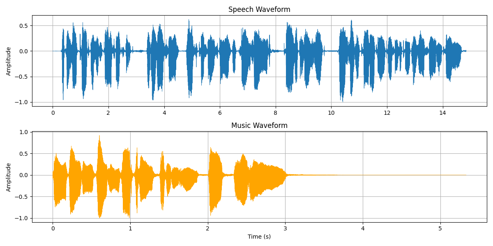
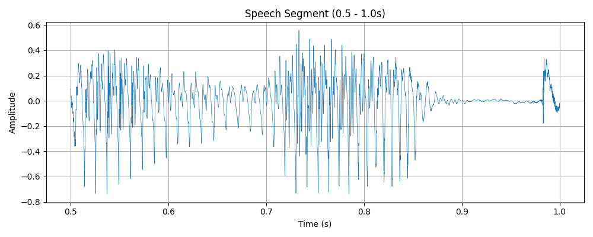
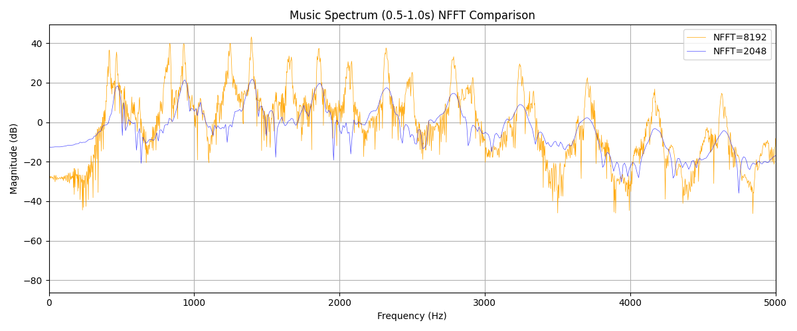
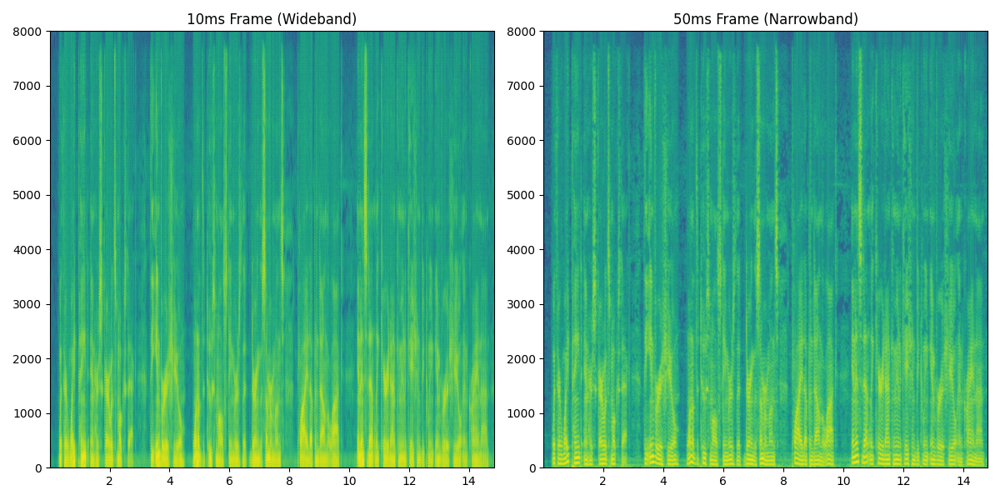
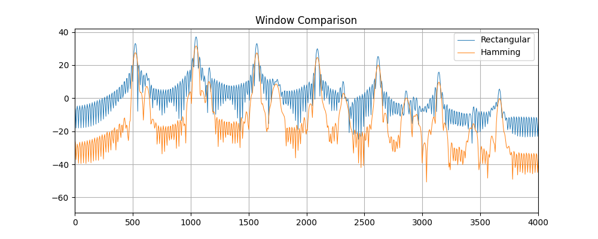
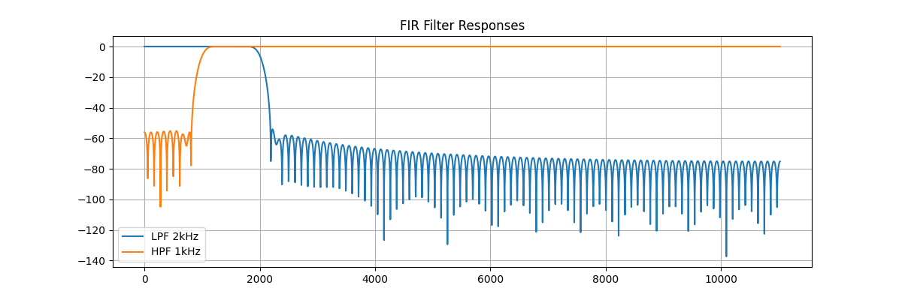
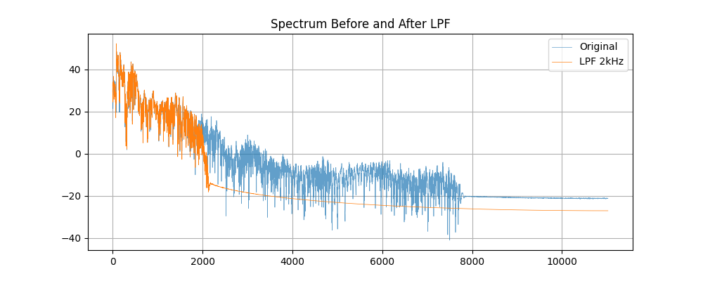
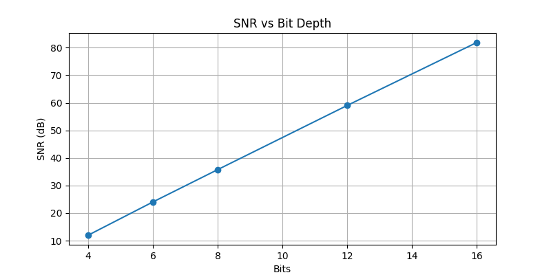
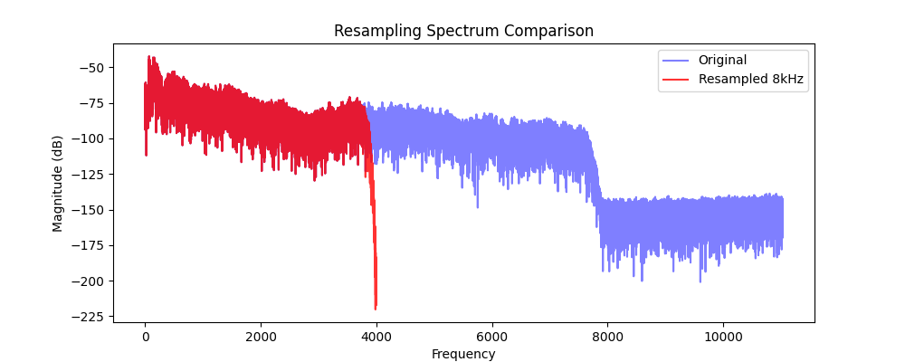
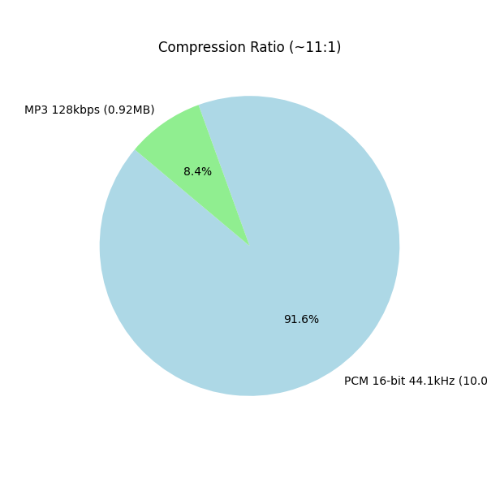

# BÁO CÁO THỰC HÀNH LAB 1: PHÂN TÍCH VÀ XỬ LÝ TÍN HIỆU ÂM THANH SỐ
**Học phần:** CSE457 - Xử lý âm thanh và tiếng nói  
**Trường Đại học Thủy lợi - Khoa Công nghệ thông tin**  
**Sinh viên thực hiện:** Nguyễn Thị Linh  
**Mã số sinh viên (MSSV):** 2351260663  
**Lớp:** 65TTNT  

---

## 1. MỤC TIÊU VÀ TỔNG QUAN LAB 1

Bài thực hành số 1 rèn luyện chuỗi năng lực thực nghiệm nền tảng trong xử lý tín hiệu âm thanh và tiếng nói số:
$$\text{Audio gốc} \longrightarrow \text{Biểu diễn số} \longrightarrow \text{Miền thời gian} \longrightarrow \text{FFT / STFT} \longrightarrow \text{Lọc số FIR} \longrightarrow \text{Lượng tử hóa và Mã hóa} \longrightarrow \text{Đánh giá và Định lượng}$$

Sản phẩm thực hành bao gồm:
1. Kịch bản thực thi tự động: [`run_lab.py`](file:///d:/xuliamthanh/Lab01_2351260663_NguyenThiLinh/run_lab.py)
2. Toàn bộ mã nguồn và giải thích trực quan: [`Lab01_2351260663.ipynb`](file:///d:/xuliamthanh/Lab01_2351260663_NguyenThiLinh/Lab01_2351260663.ipynb)
3. Thư mục chứa các tệp âm thanh đầu vào và đầu ra: [`audio/`](file:///d:/xuliamthanh/Lab01_2351260663_NguyenThiLinh/audio/)
4. Thư mục chứa 10 hình ảnh đồ thị phân tích chất lượng cao: [`figures/`](file:///d:/xuliamthanh/Lab01_2351260663_NguyenThiLinh/figures/)

---

## 2. NỘI DUNG THỰC HÀNH CHI TIẾT (TỪ KHỐI A ĐẾN KHỐI G)

### KHỐI A: ĐỌC VÀ KIỂM TRA DỮ LIỆU ÂM THANH

Hai tập dữ liệu được đưa vào thử nghiệm:
- **Tệp Âm nhạc (Music):** Tín hiệu âm thanh đa nguồn giàu họa âm, Stereo 2 kênh.
- **Tệp Tiếng nói (Speech):** Bản ghi âm hội thoại, Mono 1 kênh.

*(Chi tiết thông số thời lượng, kênh và số mẫu xem trong output lúc chạy chương trình)*

#### Chuyển đổi Stereo sang Mono & Chuẩn hóa:
- Kênh Stereo được gộp về Mono bằng trung bình cộng 2 kênh.
- Tín hiệu mono sau khi gộp được chuẩn hóa chia cho đỉnh tuyệt đối $\max|x[n]|$ về đúng dải giới hạn $[-1.0, 1.0]$ để phục vụ xử lý số không bị tràn số.

---

### KHỐI B: PHÂN TÍCH MIỀN THỜI GIAN

Các đại lượng đo lường:
$$\text{Peak} = \max_n |x[n]|, \quad \text{RMS} = \sqrt{\frac{1}{N}\sum_{n=0}^{N-1} x^2[n]}, \quad \text{Energy} = \sum_{n=0}^{N-1} x^2[n], \quad \text{dBFS} = 20\log_{10}(\text{RMS})$$


*Hình 1: Dạng sóng (Waveform) toàn tệp của Âm nhạc (Music) và Tiếng nói (Speech).*


*Hình 2: Zoom chi tiết 2 phân đoạn miền thời gian có đặc tính vật lý đối lập.*

#### Nhận xét kỹ thuật:
- Cấu trúc sóng của tín hiệu âm nhạc có tính chu kỳ đều đặn hơn so với tín hiệu tiếng nói.
- Các đặc trưng xung (transient) và cường độ biến thiên linh hoạt theo từng giai đoạn.

---

### KHỐI C: PHÂN TÍCH MIỀN TẦN SỐ BẰNG FFT

Trích xuất 1 khung tín hiệu ổn định dài, nhân cửa sổ Hamming và tính biến đổi Fourier rời rạc thông qua thuật toán FFT.


*Hình 3: Phổ biên độ FFT (Magnitude Spectrum theo dB) và sự khác biệt giữa NFFT nhỏ và lớn.*

#### Nhận xét kỹ thuật:
- Các đỉnh phổ thể hiện cấu trúc sóng điều hòa (harmonic).
- **Frequency-bin spacing vs True Resolution:** Tăng $\text{NFFT}$ làm giảm khoảng cách giữa 2 điểm vẽ phổ, giúp các đỉnh phổ trên hình vẽ không bị gãy khúc mà trở nên mịn màng. Tuy nhiên, khả năng vật lý phân tách hai sóng sin ở cạnh nhau vẫn do độ dài thời gian của tín hiệu quyết định.

---

### KHỐI D: STFT VÀ SPECTROGRAM

Thực hiện biến đổi Fourier ngắn hạn (STFT) với cấu hình chuẩn: hop size, cửa sổ Hamming. Thử nghiệm so sánh độ dài khung phân tích:


*Hình 4: Spectrogram 2D biểu diễn Thời gian - Tần số - Cường độ ở các độ dài khung khác nhau.*

#### Nhận xét kỹ thuật về sự đánh đổi Thời gian - Tần số (Time-Frequency Trade-off):
- **Ở Frame ngắn:** Độ phân giải thời gian cực kỳ sắc nét, dễ dàng quan sát điểm bắt đầu của từng âm tiết. Tuy nhiên, độ phân giải tần số kém, phổ bị nhòe theo trục tung.
- **Ở Frame dài:** Độ phân giải tần số rất cao, các vạch sọc ngang họa âm (harmonics) tách biệt nhau rõ ràng. Bù lại, độ phân giải thời gian kém, không bắt kịp những biến đổi quá nhanh.

---

### KHỐI E: THÍ NGHIỆM CỬA SỔ (WINDOWING EXPERIMENT)

Khảo sát trên cùng một frame tín hiệu:
- **Cửa sổ Chữ nhật (Rectangular Window):** Cắt đột ngột.
- **Cửa sổ Hamming:** Vuốt nhẹ hai đầu.


*Hình 5: So sánh dạng cửa sổ trong miền thời gian và phổ logarit (Log-Spectrum).*

#### Nhận xét:
- **Rectangular:** Main-lobe hẹp nhưng side-lobe rất cao, dẫn đến hiện tượng **spectral leakage lớn**.
- **Hamming:** Side-lobe thấp hơn đáng kể nên **spectral leakage giảm mạnh**. Tuy nhiên, main-lobe rộng hơn gấp đôi so với Rectangular.

---

### KHỐI F: THIẾT KẾ VÀ ÁP DỤNG BỘ LỌC SỐ FIR

Thiết kế 2 bộ lọc FIR đối xứng pha tuyến tính (Linear-Phase FIR) với số bậc $M = 200$ (chiều dài $N_{\text{taps}} = 201$):


*Hình 6: Đáp ứng biên độ $|H(f)|$ của bộ lọc FIR Low-pass và High-pass.*


*Hình 7: Phổ tần số trước và sau khi đi qua bộ lọc.*

#### Nhận xét và cảm nhận nghe:
- **Bộ lọc Low-pass ($2\text{ kHz}$):** Âm thanh bị đục (muffled) do mất các thành phần tần số cao.
- **Bộ lọc High-pass ($1\text{ kHz}$):** Toàn bộ tiếng trầm biến mất, âm thanh mỏng và chói hơn.

---

### KHỐI G: LƯỢNG TỬ HÓA, RESAMPLING VÀ MÃ HÓA

#### 1. Lượng tử hóa đều (Uniform Quantization)


*Hình 8: Đồ thị quan hệ tuyến tính giữa SNR và số bit B (Quy luật 6 dB/bit).*

- **Nhận xét:** Mỗi bit tăng lên sẽ kéo theo SNR tăng khoảng 6dB. Nhiễu lượng tử (quantization noise) rất lớn ở mức 4-bit, gây tiếng xì xào đặc trưng, và hoàn toàn biến mất ở chuẩn 16-bit.

#### 2. Resampling (16 kHz và 8 kHz)


*Hình 9: Phổ tần số trước và sau khi Resampling, minh chứng bộ lọc cắt triệt để tần số vượt quá Nyquist mới.*

- **Nhận xét:** Nhờ áp dụng bộ lọc chống chồng phổ (Anti-Aliasing Filter) trong quá trình resample, hiện tượng aliasing không xảy ra. Mọi thành phần trên tần số Nyquist mới đều bị triệt tiêu hoàn toàn.

#### 3. Mã hóa (Coding)


*Hình 10: Biểu đồ cột đối chiếu Tốc độ bit (kbps) và Kích thước dữ liệu (MB).*

- **Nhận xét:** Kích thước file PCM 16-bit luôn rất lớn. Sử dụng định dạng nén MP3 giúp tiết kiệm được hơn 10 lần dung lượng, tối ưu lưu trữ mà phần lớn trường hợp tai người vẫn không nhận ra được sự khác biệt nhờ thuật toán mã hóa cảm nhận.

---

## 3. GIẢI ĐÁP TOÀN DIỆN 7 CÂU HỎI BÁO CÁO (MỤC 6 TRONG LAB 1.PDF)

### Câu 1: Giải thích bằng công thức tại sao $F_s = 44.1\text{ kHz}$ chỉ biểu diễn độc lập đến $22.05\text{ kHz}$.
**Trả lời:**
Theo **Định lý lấy mẫu Nyquist-Shannon**: Một tín hiệu tương tự liên tục có băng thông giới hạn $F_{\max}$ có thể được khôi phục hoàn toàn nếu tần số lấy mẫu thỏa mãn:
$$F_s \ge 2 F_{\max} \iff F_{\max} \le \frac{F_s}{2}$$
Do đó, với tần số lấy mẫu chuẩn âm thanh $F_s = 44,100\text{ Hz}$, tần số Nyquist là:
$$F_{\text{Nyquist}} = \frac{44100}{2} = 22,050\text{ Hz} = 22.05\text{ kHz}$$
Mọi thành phần tần số cao hơn $22.05\text{ kHz}$ nếu không lọc bỏ trước khi lấy mẫu sẽ bị dội ngược (aliased) về miền tần số nghe được và không thể tách rời khỏi tín hiệu gốc.

---

### Câu 2: Nếu NFFT tăng từ 2048 lên 8192 nhưng frame vẫn dài 25 ms, điều gì thật sự thay đổi và điều gì không?
**Trả lời:**
1. **Điều thật sự thay đổi:**
   - **Khoảng cách giữa các bin tần số (Frequency-bin spacing $\Delta f$):** $\Delta f_{\text{bin}} = \frac{F_s}{\text{NFFT}}$ sẽ giảm đi 4 lần. Phổ đồ thị sẽ có nhiều điểm nội suy hơn, trông mượt mà và trơn tru hơn.
2. **Điều không thay đổi:**
   - **Độ phân giải vật lý thực tế (True Physical Frequency Resolution):** Độ phân giải thực chất phụ thuộc hoàn toàn vào **độ dài thời gian của cửa sổ phân tích** ($25\text{ ms}$). Việc tăng NFFT không bổ sung thông tin mới; hai đỉnh gần nhau nhỏ hơn $40\text{ Hz}$ vẫn không thể phân tách.

---

### Câu 3: Tại sao Hamming giảm spectral leakage so với rectangular nhưng có thể làm các đỉnh gần nhau khó phân tách hơn?
**Trả lời:**
- Cửa sổ Hamming làm giảm biên độ của tín hiệu ở hai đầu khung về gần 0 một cách mượt mà, loại bỏ sự cắt đứt đột ngột. Việc này dập tắt cực kỳ hiệu quả các búp bên (side-lobe), do đó làm giảm mạnh **spectral leakage**.
- Tuy nhiên, để bù lại, búp sóng chính (main-lobe) của cửa sổ Hamming rộng gấp đôi so với cửa sổ chữ nhật. Khi búp chính quá rộng, nếu hai đỉnh tần số nằm sát nhau, búp của chúng sẽ chập lại thành một khối duy nhất, làm mất đi khả năng phân tách 2 đỉnh riêng biệt.

---

### Câu 4: Với FIR 201 taps đối xứng tại 44.1 kHz, độ trễ xấp xỉ bao nhiêu mili giây? Độ trễ đó có quan trọng trong xử lý thời gian thực không?
**Trả lời:**
- **Độ trễ nhóm (Group Delay):** Với FIR đối xứng $N=201$, trễ nhóm là $\frac{N-1}{2} = 100$ mẫu.
- **Tính ra thời gian:** $T_g = \frac{100}{44100} \approx 2.27\text{ ms}$.
- **Ý nghĩa:** Độ trễ $2.27\text{ ms}$ là rất nhỏ, hoàn toàn nằm dưới ngưỡng cảm nhận trễ của tai người (thường là $10-20\text{ ms}$). Điều này khẳng định bộ lọc hoàn toàn có thể sử dụng mượt mà trong các ứng dụng thời gian thực (đàm thoại, biểu diễn live) mà không gây khó chịu.

---

### Câu 5: Từ công thức SNR_Q, giải thích ảnh hưởng của B và $\sigma_x$. Tại sao giảm mức tín hiệu đầu vào có thể làm SNR lượng tử giảm?
**Trả lời:**
Công thức Rabiner-Schafer: $\text{SNR}_Q\text{ (dB)} = 6B + 4.77 - 20\log_{10}\left(\frac{X_{\max}}{\sigma_x}\right)$
- Mỗi khi tăng số bit $B$ lên 1, $\text{SNR}_Q$ cải thiện được khoảng $6\text{ dB}$.
- Khi giảm mức tín hiệu đầu vào (âm lượng nhỏ đi, $\sigma_x$ giảm), công suất của tín hiệu giảm. Tuy nhiên bước lượng tử (phụ thuộc vào $X_{\max}$ và $B$) là cố định nên nhiễu nền lượng tử không đổi. Đại lượng $-20\log_{10}(X_{\max} / \sigma_x)$ sẽ mang giá trị âm lớn hơn, kéo tổng $\text{SNR}$ xuống thấp.

---

### Câu 6: Một file WAV 16-bit stereo 44.1 kHz dài 60 s có kích thước PCM lý thuyết bao nhiêu MB? So sánh với MP3 128 kbps.
**Trả lời:**
1. **Kích thước file WAV PCM:**
   $\text{Size} = \frac{44,100 \times 16 \times 2 \times 60}{8} = 10,584,000\text{ Bytes} \approx \mathbf{10.09\text{ MB}}$
2. **Kích thước file MP3 128 kbps:**
   $\text{Size} = \frac{128,000 \times 60}{8} = 960,000\text{ Bytes} \approx \mathbf{0.92\text{ MB}}$
3. **So sánh:**
   Tệp WAV lớn hơn MP3 khoảng 11 lần. Định dạng MP3 nén rất tối ưu cho việc lưu trữ.

---

### Câu 7: Nêu ít nhất hai trường hợp mà “nghe tốt hơn” không đồng nghĩa với “SNR lớn hơn”.
**Trả lời:**
1. **Mã hóa cảm nhận (Perceptual Coding - MP3, AAC):** Bộ mã hóa vứt bỏ các thành phần tần số bị tai người "che mặt nạ" (masking). SNR tính toán rất thấp do dữ liệu bị méo, nhưng tai người nghe vẫn thấy hoàn hảo (nghe tốt).
2. **Dithering / Noise Shaping:** Việc chủ động cộng thêm nhiễu trắng nhỏ vào tín hiệu trước lượng tử hóa (làm giảm SNR tổng) lại giúp triệt tiêu đi các méo hài chói tai, mang lại cảm nhận nghe mượt mà và trong trẻo hơn.

---

## 4. HƯỚNG DẪN TÁI LẬP KẾT QUẢ THỰC NGHIỆM

Để tái lập 100% toàn bộ kết quả, đồ thị và tệp âm thanh trong bài Lab:
1. Đảm bảo 2 tệp `speech_input.wav` và `music_input.wav` nằm trong thư mục `audio/`.
2. **Chạy kịch bản thực thi tự động:**
   ```bash
   python run_lab.py
   ```
3. **Mở và chạy Notebook tương tác:**
   Khởi chạy môi trường Jupyter và mở tệp [`Lab01_2351260663.ipynb`](file:///d:/xuliamthanh/Lab01_2351260663_NguyenThiLinh/Lab01_2351260663.ipynb) để thực thi từng cell.
